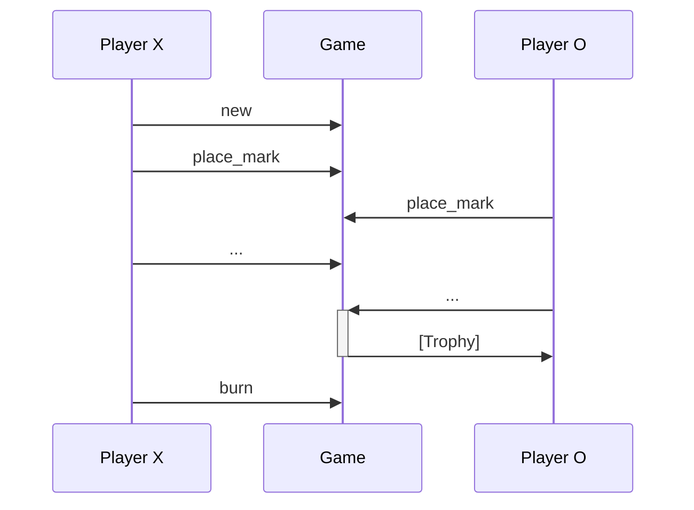
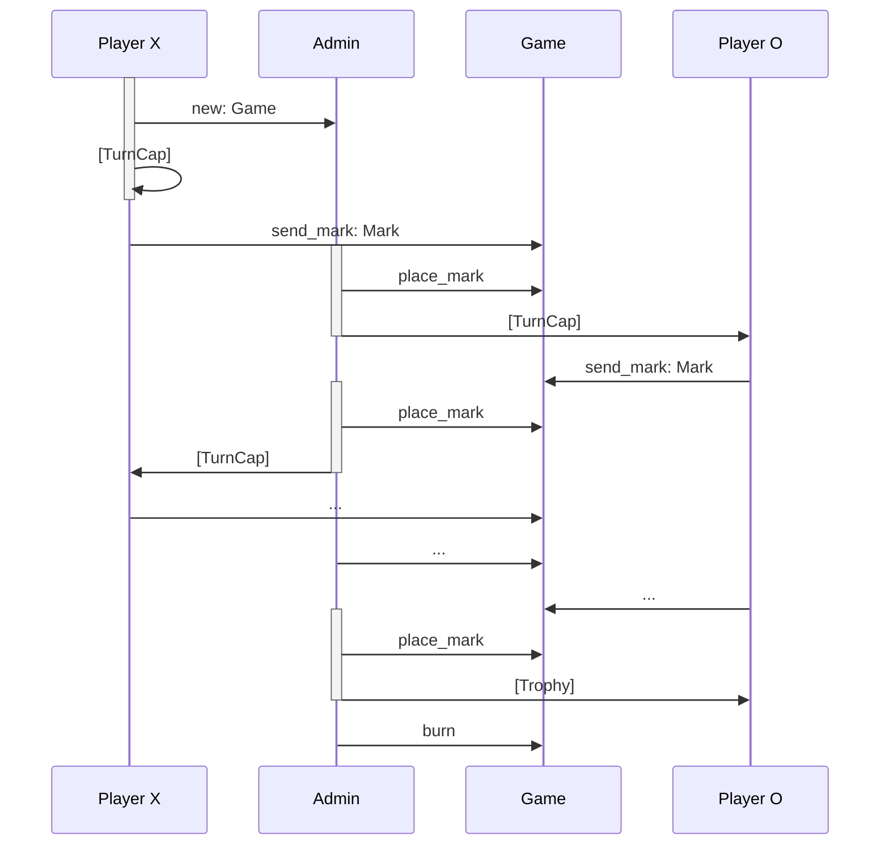

# Tic tac toe

This is an end-to-end example for on-chain tic-tac-toe. It includes:

-   A [Move package](./move), containing two protocols for running a game of
    tic-tac-toe. One that uses shared objects and consensus and another
    that uses owned objects, and the fast path (no consensus).
-   A [React front-end](./ui), in TypeScript built on top of
    `create-react-dapp`, using the TS SDK and `dapp-kit`.
-   A [Rust CLI](./cli), using the Rust SDK.
-   [Scripts](./scripts) to publish packages and update configs used
    while building the front-end and CLI.

## Shared tic tac toe

In the shared protocol, player X creates the `Game` as a shared object
and players take turns to place marks. Once the final move is made, a
`Trophy` is sent to any winning player (if there is one). After the
game has ended, anyone can `burn` the finished game to reclaim the
storage rebate (either of the players, or a third party).

Validation rules in the Move package ensure that the sender of each
move corresponds to the address of the next player, and the game can
only be `burn`-ed if it has ended.

## Owned tic tac toe

In the owned protocol, player X creates the `Game` and sends it to an
impartial third party -- the Admin -- who manages players' access to
the game.

Marks are placed in two steps: In the first step, the player creates a
`Mark` which describes the move they want to make and sends it to the
`Game` (using transfer to object). In the second step, the Admin
receives the `Mark` on the game and places it.

Control of who makes the next move is decided using a `TurnCap`.
Initially Player X has the `TurnCap`. This capability must be consumed
to create a `Mark`, and when the admin places the mark, a new
`TurnCap` is created and sent to the next player, if the game has not
ended yet.

As in the shared protocol, once the game has ended, a `Trophy` is sent
to any winning player. Unlike the shared protocol, only the admin can
clean-up the Game once it has finished, because only they have access
to it.

## Pros and cons

The shared protocol's main benefit is that its on-chain logic and
client integration are straightforward, and its main downside is that
it relies on consensus for ordering.

In contrast, the owned protocol uses only fast-path transactions, but
its on-chain logic is more complicated because it needs to manage the
`TurnCap`, and its off-chain logic is complicated by requiring a third
party service to act as an Admin.
